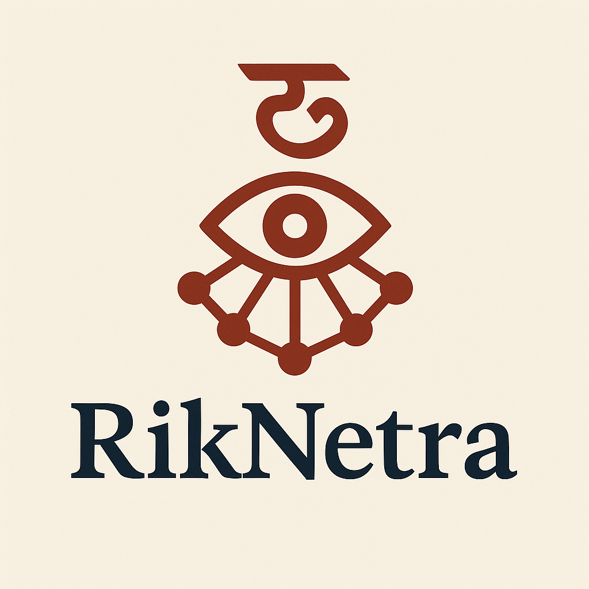

# RikNetra

RikNetra is an interactive web platform for exploring the Rigveda, an ancient Hindu scripture, through TFIDF filtered hybrid semantic search, an interactive network visualization of interrelated hymns, and retrieval augmented generation of queries and summaries. Our multimodal platform presents the text search with network visualizations on a search-engine results page by leveraging natural language processing (NLP) and graph-based visualization to enable scholars, researchers, and enthusiasts to navigate Rigvedic hymns (suktas) intuitively.



[](https://vimeo.com/1118529324)


## Features

- **Hybrid Search**: Search Rigveda suktas using keywords, queries, or specific hymn references (e.g., "RV 1.1", "hymns to Agni"). Powered by TFIDF filtering and SentenceTransformer embeddings and for enhanced query understanding.
- **Dynamic Hymn Network Visualization**: Visualize connections between suktas using an interactive force-directed graph, built with D3.js. Supports zoom, drag, node highlighting, and topic-based color coding.
- **RAG Summary**: Retrieve augmented generation (RAG) summaries for search results, providing concise insights into selected hymns using Cohere's language model.
- **Triptych Layout SERP**: Displays search engine results page (SERP) in a three-column layout: top results, connection network, and RAG summary.
- **Dark Mode**: Toggle between light and dark themes for comfortable reading.
- **Sukta Reader**: Read full texts of suktas with related connections, sourced from Griffith's and Jamison's translations of the Rigveda.
- **Database Selection**: Choose from multiple graph databases (k3 to k11) representing suktas with varying connection densities (2 to 10 neighbors).
- **Topic Visualization**: Toggle topic-based node coloring in the graph to highlight thematic clusters (e.g., Creation, Marut, Surya).

## Tech Stack

- **Backend**:
  - Flask (Python): Serves the semantic search API.
  - PyTorch & SentenceTransformers (`all-mpnet-base-v2`): Generates text embeddings for semantic similarity.
  - Cohere API: Powers RAG-based summarization.
  - TFIDF Vectorizer: Enhances query processing with keyword extraction.
  - NLTK: Handles text preprocessing (stopwords, tokenization).
  
- **Frontend**:
  - HTML/CSS/JavaScript: Core web interface.
  - D3.js: Renders interactive force-directed graphs.
  - Font Awesome: Provides icons for UI elements.
  
- **Data**:
   - Griffith’s and Jamison’s Rigveda Translations: Text sources for suktas.
   - Precomputed Embeddings: Stored in `sbert_queryembeddings.tsv` for efficient similarity search.
   - JSON Databases: Graph data (nodes and edges) for suktas with varying connections (k3 to k11) computed using the Leiden method from data processed in,
     - *Venkatesh Bollineni, Igor Crk, and Eren Gultepe. 2025. Mapping Hymns and Organizing Concepts in the Rigveda: Quantitatively Connecting the Vedic Suktas. In Proceedings of the 5th International Conference on Natural Language Processing for Digital Humanities at NAACL 2025, pages 514–523, Albuquerque, USA. Association for Computational Linguistics.* [https://doi.org/10.18653/v1/2025.nlp4dh-1.44](https://aclanthology.org/2025.nlp4dh-1.44/)
   - TSV and Text Files: Sukta labels (`suktalabels.tsv`) and preprocessed Rigveda text (`consuktasrigveda.txt`).

## Hymn Retrieval and RAG Summary Results

The following are expanded results of hymn retrievals presented in the paper and RAG summaries for example queries:

[Detailed Hymn Retrieval Comparison Tables](docs/Hymn_Retrieval_Results.md)  
[Comparison RAG Summaries for Queries](docs/RAG_Summaries.md)

## Installation

### Prerequisites
- Python 3.8+
- Node.js (optional, for local development)
- Git
- Cohere API key (sign up at [Cohere](https://cohere.ai/))

### Steps

1. **Clone the Repository**:
   git clone https://github.com/AshaShah/RikNetra.git
   cd RikNetra

2. **Install Python Dependencies**:
    `pip install -r requirements.txt`

3. **Configure Cohere API Key**:
   Replace the placeholder API key in `semanticsearch.py` with your Cohere API key:
   co = cohere.Client(api_key="your-cohere-api-key")

4. **Download NLTK Data**:
   `python -c "import nltk; nltk.download('stopwords'); nltk.download('punkt')"`

5. **Prepare Data**:
   Ensure the following files are in the `pythoncode/` directory:
   - `Griff_translation.txt`: Griffith’s sukta texts.
   - `sbert_queryembeddings.tsv`: Precomputed embeddings.
   - `suktalabels.tsv`: Sukta labels.
   - `consuktasrigveda.txt`: Preprocessed Rigveda text for TF-IDF.
   - Place graph databases (`k3database.json to k11database.json`) in the `database/` directory.

6. **Run the Flask API**:
   python run.py
   The API will run at `http://localhost:5000`.
      
### Usage

1. **Home Page (`index.html`)**:
   - Enter a search query (e.g., "RV 1.1", "hymns to Indra", or "What is creation").
   - Select a database (k3 to k11) to adjust connection density.
   - View results in the triptych layout: top results, graph visualization, and RAG summary.
   - Click tags (e.g., "Purusha Sukta") for quick searches.

2. **Sukta Connections (`suktasconnection.html`)**:
   - Explore suktas as an interactive force-directed graph.
   - Click nodes to view connections, zoom, or open a popup with related suktas.
   - Use controls to toggle sukta numbers, hide unselected, or enable topic-based coloring.
   - Zoom in/out or reset the view using dedicated buttons.

3. **Read Suktas (`chapter.html`)**:
   - View full sukta text (Both in English and Sanskrit) with related suktas listed in a dropdown format.
   - Search for specific suktas (e.g., "RV 1.1") to load their content.
   - Select different databases to view connections in the new context.

### Project Structure
```
RikNetra/
├── .vscode/
├── database/
│   ├── k3database.json
│   ├── k4database.json
│   ├── k5database.json
│   ├── k6database.json
│   ├── k7database.json
│   ├── k9database.json
│   ├── k10database.json
│   └── k11database.json
├── pythoncode/
│   ├── __pycache__/
│   ├── consuktasrigveda.txt
│   ├── Griff_translation.txt
│   ├── sbert_queryembeddings.tsv
│   ├── sbertmodel.py
│   ├── semanticsearch.py
│   └── suktalabels.tsv
├── static/
│   ├── css/
│   │   ├── chapter.css
│   │   ├── index.css
│   │   └── suktaconnection.css
│   ├── Images/
│   │   └── riknetra.png
│   └── js/
│       ├── darkmode/
│       │   └── darkMode.js
│       └── searchcomponent.js
├── templates/
│   ├── chapter.html
│   ├── index.html
│   └── suktasconnection.html
├── .env
├── README.md
├── requirements.txt
└── run.py
```

## Contributing

Contributions are welcome! Please follow these steps:

   - Fork the repository.
   - Create a feature branch (git checkout -b feature/your-feature).
   - Commit your changes (git commit -m "Add your feature").
   - Push to the branch (git push origin feature/your-feature).
   - Open a pull request.

## Acknowledgments
   - Griffith’s and Jamison’s Translations of the Rigveda for textual data.
   - SentenceTransformers for semantic embeddings.
   - Cohere for RAG summarization.
   - D3.js for graph visualization.
   - Font Awesome for UI icons.

## Contact
For questions, contact Dr. Eren Gultepe egultep@siue.edu, Asha Shah ashashah228@gmail.com, Venkatesh Bollineni, vbollin@siue.edu


© 2025 RikNetra. All rights reserved.


